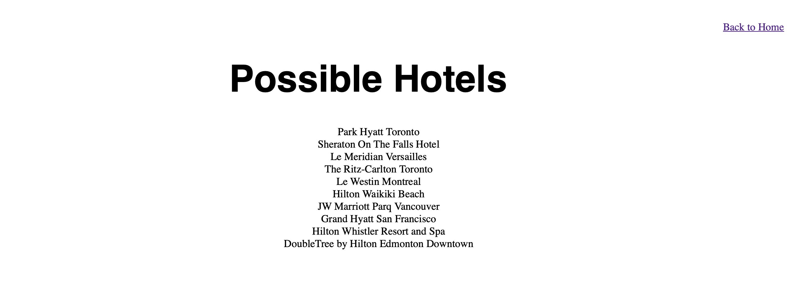

# Hotel-Database-System

Hotel Database Information Retrieval System for use by internal employees. 

An [Entity Relationship Diagram](#entity-relationship) and a [Relational Diagram](#relational-diagram) was generated for this database management system. This project was completed in a team of three for MSCI 346: Database Systems final project.

Technologies used include SQL, PHP, HTML, CSS, Brackets. 

## Application Functionality

#### 1. **[Update Booking](#update-booking)**
#### 2. **[Hotel Availability](#hotel-availability)**
#### 3. **[Employee Stats](#employee-stats)**
#### 4. **[Event Booking](#event-booking)**
#### 5. **[Edit Guest Info](#edit-guest-info)**

The user first enters their booking ID.
  

## Application Functionality Details

#### 1. Update Booking
This query demonstrates updating the database information. The update booking query allows individuals to make changes to guest bookings. Employees must enter a guest booking ID to modify the number of individuals in the room. This change is then reflected in the database. 

The user first enters their booking ID.
  

The user is then taken to a pre-populated screen where they can adjust the number of individuals in the room.
  

After submission, they are either taken to a success or error screen. The success screen includes their booking ID.
  

[Back to Top](#top)

#### 2. Check Hotel Availability
This query demonstrates the use of nested query and an aggregate function (count). The check hotel availability query allows front desk staff to select a hotel chain, a desired hotel and dates. The user then will be given a list of the types and number of rooms available.  

  The user first selects their desired hotel and the time intervals for their stay.
  

  A list is then shown with the number of available rooms for each room type during that time interval.
  

[Back to Top](#top)

#### 3. Employee Statistics
This query demonstrates the use of aggregate functions (avg, max, min) and natural join. The employee statistics query was created for upper management to view employee salary and average hours worked per week. The query allows the user to select a chain, then select a hotel and finally an employee type. 

  The user first selects their desired hotel chain.
  

  The next screen is prepopulated with the different hotels within that chain.
  

  The employee statistics are then shown for the chosen hotel and employee type. The user may select all types of employees if they desire.
  

[Back to Top](#top)

#### 4. Event Booking For Large Groups
This query demonstrates the use of group by and having. The event booking for large groups query is utilized to check which hotels are able hold an event based on the count of the room capacities when planning large scale events. The Party size is entered, and a list of possible hotels is generated that have enough room capacity to accommodate guests. 

  The user enters the number of people in the group.
  

  A list of hotels is then generated that support the group size.
  

[Back to Top](#top)

#### 5. Edit Guest Information
This query demonstrates insert, update and delete of an entity. The edit guest information query allows individuals to make changes to guest information stored in the database. Attributes that may be updated include name, city, street, postal code and phone number. A guest may also be added to the database or deleted from the database. 

  The first screen provides users with different guest management requests.
  

  If the user selects sign up, a sign up form is shown for population.
  

[Back to Top](#top)

## Entity Relationship

  

[Back to Top](#top)

## Relational Diagrams

  

[Back to Top](#top)
